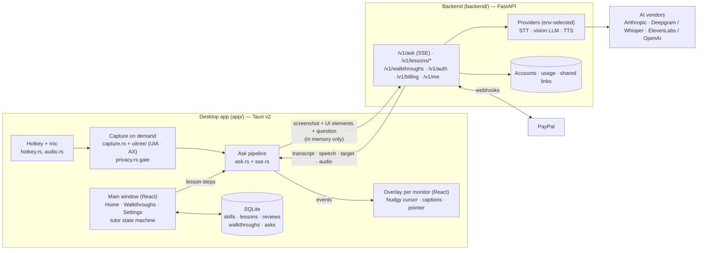

# Nudgy

A desktop tutor that lives next to your cursor (Windows 10/11, macOS 13+). Hold a hotkey, ask
how to do something, and Nudgy tells you the next step out loud and moves its cursor to the
exact button. Ask it to teach you and it runs a step-by-step lesson in your own app, checking
each step, tracking your skills with spaced repetition. Record a task once and it becomes a
guided walkthrough anyone can follow.

Privacy first: the screen is only captured while you hold the hotkey (or during a lesson you
started), password fields and blocklisted apps are never captured, and screenshots are never
stored. See [`docs/privacy-policy.md`](docs/privacy-policy.md).

| Doc | What |
|-----|------|
| [`PLAN.md`](PLAN.md) | Architecture and phase checklist |
| [`DECISIONS.md`](DECISIONS.md) | Why things are the way they are |
| [`DESIGN_AUDIT.md`](DESIGN_AUDIT.md) | The nudgy-kit redesign, change by change |
| [`TESTING.md`](TESTING.md) | Manual test checklist per phase (Windows + Mac) |
| `brand/`, `design/` | Logo, icon, brand notes, mockups |

## Architecture



- The desktop app never calls AI vendors directly; everything goes through the backend, which
  holds the keys and enforces plan limits.
- One ask: hotkey down → mic + capture of the monitor under the cursor (skipped for password
  fields / blocklisted apps) → release → `POST /v1/ask` → the backend streams back the
  transcript, spoken text, the element to point at and TTS audio per sentence → the overlay
  speaks, captions and flies the Nudgy cursor to the target (physical pixels, converted only
  in `geometry.rs`).
- Lessons: `/v1/lessons/plan` → the tutor state machine (`app/src/features/tutor/tutor.ts`)
  brings the target app to the front, instructs each step, verifies it with a fresh capture
  when you pause (`/v1/lessons/verify`), hints, and records results locally for SM-2 reviews.

| Path | What |
|------|------|
| `app/src/` | React UI: main window, overlay, ask box, tutor, i18n (`i18n/locales/en.json`) |
| `app/src-tauri/src/` | Rust core: hotkey, audio, capture, UI trees, overlay windows, SQLite store, recorder, accounts, updater |
| `backend/app/` | FastAPI: routers, services, providers (`providers/`), models |
| `backend/prompts/` | Versioned LLM system prompts |
| `backend/config/` | Plans, languages, voices (config, not code) |
| `scripts/` | `check_targets.sh` cross-compiles the Rust crate for Windows + macOS from Linux |

## Run it locally

Prerequisites: Node 22, Rust stable, Python 3.11+, and the
[Tauri prerequisites](https://v2.tauri.app/start/prerequisites/) for your OS.

```bash
cp .env.example .env            # the default "fake" providers need no API keys

# backend
cd backend
python -m venv .venv && . .venv/bin/activate    # Windows: .venv\Scripts\activate
pip install -e ".[dev]"
uvicorn app.main:app --reload --port 8787

# app (second terminal)
cd app
npm install
npm run tauri dev
```

The first launch opens a short intro (on macOS it walks through the Screen Recording,
Accessibility and Microphone permissions). After that Nudgy lives in the tray / menu bar;
hold **Ctrl+Alt+Space** (⌃⌥Space on Mac) and ask, or tap it twice to type.

To use real AI, set in `.env`:

```bash
NUDGY_LLM_PROVIDER=anthropic   ANTHROPIC_API_KEY=…
NUDGY_STT_PROVIDER=deepgram    DEEPGRAM_API_KEY=…      # or openai_whisper + OPENAI_API_KEY
NUDGY_TTS_PROVIDER=elevenlabs  ELEVENLABS_API_KEY=…    # or openai_tts + OPENAI_API_KEY
```

## Environment variables

Every variable is documented in [`.env.example`](.env.example) with a blank or safe value.
`.env` is git-ignored; never commit it.

| Group | Variables |
|-------|-----------|
| Server | `NUDGY_ENV` (`dev`/`production`), `NUDGY_DATABASE_URL`, `NUDGY_CORS_ORIGINS`, `NUDGY_PUBLIC_URL` |
| AI | `NUDGY_LLM_PROVIDER`, `NUDGY_STT_PROVIDER`, `NUDGY_TTS_PROVIDER`, `NUDGY_LLM_MODEL`, `NUDGY_LLM_THINKING`, `NUDGY_LLM_EFFORT`, `ANTHROPIC_API_KEY`, `DEEPGRAM_API_KEY`, `ELEVENLABS_API_KEY`, `OPENAI_API_KEY` |
| Accounts | `NUDGY_JWT_SECRET` (≥32 chars in production), `NUDGY_AUTH_REQUIRED`, `NUDGY_EMAIL_*`, `NUDGY_SMTP_*`, `NUDGY_GOOGLE_*`, `NUDGY_APPLE_*` |
| Launch | `NUDGY_LAUNCH_DATE` (free year starts; blank in dev), `NUDGY_FREE_UNTIL_OVERRIDE`, `NUDGY_FREE_TIER_LESSONS_PER_MONTH` (initial value only), `NUDGY_ADMIN_TOKEN` |
| Billing (PayPal) | `PAYPAL_ENV`, `PAYPAL_CLIENT_ID`, `PAYPAL_CLIENT_SECRET`, `PAYPAL_WEBHOOK_ID`, `PAYPAL_PLAN_PRO` ($20/month), `PAYPAL_PLAN_PRO_YEARLY` ($40/year), `PAYPAL_PLAN_TEAM` |

Outside `NUDGY_ENV=dev` the server refuses to start with fake providers, a weak JWT secret,
sign-in turned off, console email, or a public URL that isn't `https://`.

## Tests

```bash
cd backend && pytest -q && ruff check .
cd app && npm run build && npx vitest run
cd app/src-tauri && cargo test && cargo clippy
scripts/check_targets.sh        # Windows + macOS type-check from Linux
```

CI (`.github/workflows/ci.yml`) runs all of these, with the Rust tests on Linux, Windows and
macOS. Manual checks that need real hardware are in [`TESTING.md`](TESTING.md).

## Build and release

- **Windows test build**: push a tag `test-N`; `.github/workflows/test-build.yml` builds the unsigned
  installer and `nudgy-server.exe` (the backend as one program, `backend/nudgy-server.spec`) into a
  draft release.
- **Local installer**: `cd app && npm run tauri build` (MSI + NSIS on Windows, .app + DMG on macOS).
- **Release**: bump `version` in `app/src-tauri/tauri.conf.json` and `app/package.json`, then
  push a tag `vX.Y.Z`. `.github/workflows/release.yml` builds signed, notarized installers and a
  draft GitHub release with `latest.json` for the in-app updater (Settings → About → Updates).
  One-time setup: `npx tauri signer generate`, store the private key as the
  `TAURI_SIGNING_PRIVATE_KEY` secret and the public key as the `TAURI_UPDATER_PUBKEY` variable,
  plus the Apple and Windows signing secrets listed at the top of the workflow.
- **Backend**: `docker build -f backend/Dockerfile -t nudgy-backend .` and run it with your env
  vars (a `/data` volume holds SQLite; point `NUDGY_DATABASE_URL` at Postgres to scale out).
  Put it behind HTTPS and set `NUDGY_PUBLIC_URL`; the PayPal webhook goes to
  `/v1/billing/webhook`.
